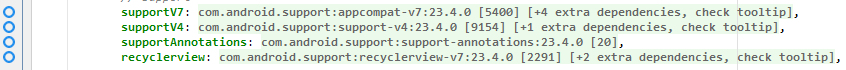
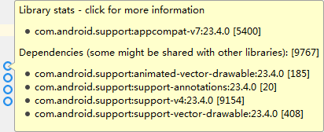
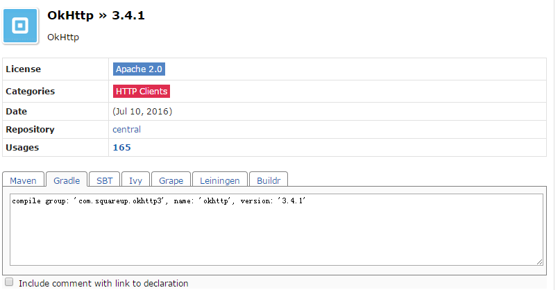
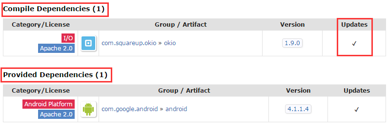
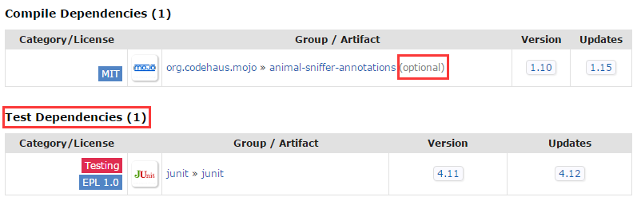

# Small Tip

## See the dependencies

- `gradle dependencies`

```
$ gradle dependencies
Incremental java compilation is an incubating feature.
:app:dependencies

------------------------------------------------------------
Project :app
------------------------------------------------------------

_debugAndroidTestApk - ## Internal use, do not manually configure ##
+--- junit:junit:4.12
|    \--- org.hamcrest:hamcrest-core:1.3
+--- org.mockito:mockito-core:1.10.19
|    +--- org.hamcrest:hamcrest-core:1.1 -> 1.3
|    \--- org.objenesis:objenesis:2.1
+--- com.squareup.assertj:assertj-android-appcompat-v7:1.1.1
+--- com.squareup.assertj:assertj-android-recyclerview-v7:1.1.1
+--- com.android.support.test.espresso:espresso-core:2.2.2
|    +--- com.squareup:javawriter:2.1.1
|    +--- com.android.support.test:rules:0.5
|    |    \--- com.android.support.test:runner:0.5
|    |         +--- com.android.support:support-annotations:23.1.1 -> 24.0.0
|    |         +--- junit:junit:4.12 (*)
|    |         \--- com.android.support.test:exposed-instrumentation-api-publish                                                                                                                :0.5
|    +--- com.android.support.test:runner:0.5 (*)
|    +--- javax.inject:javax.inject:1
|    +--- org.hamcrest:hamcrest-library:1.3
|    |    \--- org.hamcrest:hamcrest-core:1.3
|    +--- com.android.support.test.espresso:espresso-idling-resource:2.2.2
|    +--- org.hamcrest:hamcrest-integration:1.3
|    |    \--- org.hamcrest:hamcrest-library:1.3 (*)
|    +--- com.google.code.findbugs:jsr305:2.0.1
|    \--- javax.annotation:javax.annotation-api:1.2
+--- com.android.support.test:runner:0.5 (*)
\--- com.android.support:support-annotations:24.0.0

// .....
```

- [`Android Methods Count`][methodscount] plugins





- [`mvnrepository.com`][mvnrepository]







-----------------

## 


[methodscount]: http://www.methodscount.com/
[mvnrepository]: http://mvnrepository.com/