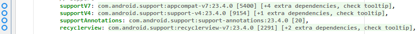
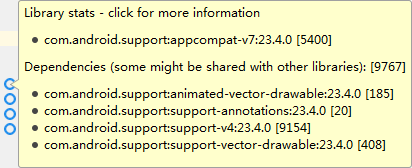
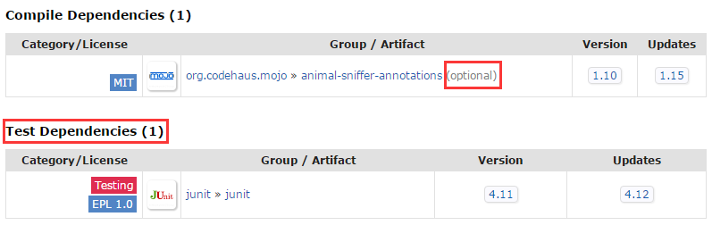

# Small Tip

## See the dependencies

- `gradle dependencies`

```
$ gradle dependencies
Incremental java compilation is an incubating feature.
:app:dependencies

------------------------------------------------------------
Project :app
------------------------------------------------------------

_debugAndroidTestApk - ## Internal use, do not manually configure ##
+--- junit:junit:4.12
|    \--- org.hamcrest:hamcrest-core:1.3
+--- org.mockito:mockito-core:1.10.19
|    +--- org.hamcrest:hamcrest-core:1.1 -> 1.3
|    \--- org.objenesis:objenesis:2.1
+--- com.squareup.assertj:assertj-android-appcompat-v7:1.1.1
+--- com.squareup.assertj:assertj-android-recyclerview-v7:1.1.1
+--- com.android.support.test.espresso:espresso-core:2.2.2
|    +--- com.squareup:javawriter:2.1.1
|    +--- com.android.support.test:rules:0.5
|    |    \--- com.android.support.test:runner:0.5
|    |         +--- com.android.support:support-annotations:23.1.1 -> 24.0.0
|    |         +--- junit:junit:4.12 (*)
|    |         \--- com.android.support.test:exposed-instrumentation-api-publish                                                                                                                :0.5
|    +--- com.android.support.test:runner:0.5 (*)
|    +--- javax.inject:javax.inject:1
|    +--- org.hamcrest:hamcrest-library:1.3
|    |    \--- org.hamcrest:hamcrest-core:1.3
|    +--- com.android.support.test.espresso:espresso-idling-resource:2.2.2
|    +--- org.hamcrest:hamcrest-integration:1.3
|    |    \--- org.hamcrest:hamcrest-library:1.3 (*)
|    +--- com.google.code.findbugs:jsr305:2.0.1
|    \--- javax.annotation:javax.annotation-api:1.2
+--- com.android.support.test:runner:0.5 (*)
\--- com.android.support:support-annotations:24.0.0

// .....
```

- [`Android Methods Count`][methodscount] plugins





- [`mvnrepository.com`][mvnrepository]




otherwise, we can quick search in the search bar: `mvn + tab`：

![mvn-quick-search][img/mvn-quick-search.png]

-----------------

## Seeing which tasks needing to run

add the option `--dry-run`:  

``` java
Executing external task 'assembleDebug  --dry-run'...
Configuration on demand is an incubating feature.
Incremental java compilation is an incubating feature.
:app:preBuild SKIPPED
:app:preDebugBuild SKIPPED
:app:checkDebugManifest SKIPPED
:app:preReleaseBuild SKIPPED
// .... some libraries
:app:prepareDebugDependencies SKIPPED
:app:compileDebugAidl SKIPPED
:app:compileDebugRenderscript SKIPPED
:app:generateDebugBuildConfig SKIPPED
:app:mergeDebugShaders SKIPPED
:app:compileDebugShaders SKIPPED
:app:generateDebugAssets SKIPPED
:app:mergeDebugAssets SKIPPED
:app:generateDebugResValues SKIPPED
:app:generateDebugResources SKIPPED
:app:mergeDebugResources SKIPPED
:app:processDebugManifest SKIPPED
:app:processDebugResources SKIPPED
:app:generateDebugSources SKIPPED
:app:incrementalDebugJavaCompilationSafeguard SKIPPED
:app:compileDebugJavaWithJavac SKIPPED
:app:compileDebugNdk SKIPPED
:app:compileDebugSources SKIPPED
:app:prePackageMarkerForDebug SKIPPED
:app:transformClassesWithDexForDebug SKIPPED
:app:mergeDebugJniLibFolders SKIPPED
:app:transformNative_libsWithMergeJniLibsForDebug SKIPPED
:app:processDebugJavaRes SKIPPED
:app:transformResourcesWithMergeJavaResForDebug SKIPPED
:app:validateDebugConfigSigning SKIPPED
:app:packageDebug SKIPPED
:app:zipalignDebug SKIPPED
:app:assembleDebug SKIPPED

BUILD SUCCESSFUL

Total time: 2.403 secs
```

run in android studio will be faster than in the command line (for my project, about 9s).  

----------------------------------------------

## build profiles

add the `--profile` option, the result will be show in `reports` folder:  

- project root:  


- project root's `\build\reports\profile`:  


- module's `\build\reports\tests`:  


----------------------------------------

## convert maven project to gradle project

`gradle init` or `gradle init --type pom`  

-----------------------------------------------

see [gradle-tips][gradle_tips_shekhargulati] and [Gradle tips & tricks to survive the zombie apocalypse][gradle_tips_cesarmcferreira] for the more good tips.

[methodscount]: http://www.methodscount.com/
[mvnrepository]: http://mvnrepository.com/
[gradle_tips_shekhargulati]: https://github.com/shekhargulati/gradle-tips
[gradle_tips_cesarmcferreira]: https://medium.com/@cesarmcferreira/gradle-tips-tricks-to-survive-the-zombie-apocalypse-3dd996604341#.bz825p9fl